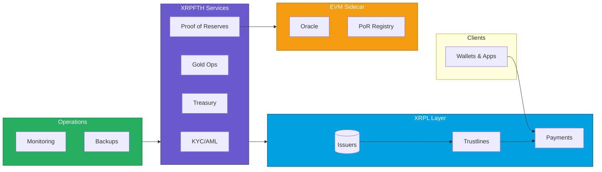

# 🚀 FTH PROGRAM — The Complete XRPL Financial Infrastructure

[](#️-what-we-built--the-complete-system)
[](#-call-to-action)
[](#-under-the-hood--technical-architecture)
[](#-why-xrpl--evm--game-changer)
[](#-trust--transparency--1048-proof-of-reserves)

---

## 💎 THE INVESTMENT OPPORTUNITY

### **Members Earn Real Returns Through:**

✅ **AUTOMATIC BONUS ACCRUAL** — Hold FTHUSD, earn USDF rewards credits (up to 8% bonus factor based on tenure)  
✅ **GOLD DISCOUNTS** — Access physical gold at program discounts (up to 12% off spot)  
✅ **EARLY EXIT REWARDS** — Structured incentives for long-term holding  
✅ **TRANSPARENT RESERVES** — Real-time 104.8%+ proof-of-reserves published on-chain  
✅ **INSTANT SETTLEMENT** — XRPL speed (3-5 seconds) vs traditional wire (1-3 days)

---

## 🎯 WHY INVESTORS CHOOSE FTH

### **The Problem We Solved**

Traditional finance is **slow**, **expensive**, and **opaque**:

- Wire transfers take 1-3 business days
- High fees (2-5% for international)
- Zero transparency on reserves
- No programmable rewards or incentives
- Compliance friction at every step

### **Our Solution: The Complete Stack**

A **production-grade XRPL infrastructure** that delivers:

- ⚡ **Instant settlement** (3-5 seconds on XRPL)
- 💰 **Automatic rewards** (USDF bonus credits for holding)
- 🥇 **Gold marketplace integration** (discounted metals, instant pricing)
- 🔐 **Verifiable reserves** (on-chain PoR via XRPL + EVM registry)
- 🏦 **Bank-grade compliance** (KYC/AML built-in, not bolted on)
- 📊 **Real-time transparency** (every transaction, every reserve snapshot, auditable)

### **Why This = Big Returns for Investors**

1. **Members pay for value** → Revenue from membership fees, transaction spreads, gold margins
2. **Network effects** → More members = deeper liquidity = better pricing = more members
3. **Compliance moat** → Built-in KYC/AML + PoR = regulatory ready = institutional adoption
4. **Scalable tech** → XRPL handles 1,500 TPS at $0.0002/tx vs Ethereum's $5-50
5. **Diversified revenue** → Memberships + gold sales + rewards program + banking rails

---

## Table of Contents

- [🏗️ WHAT WE BUILT — The Complete System](#️-what-we-built--the-complete-system)
- [💰 HOW MEMBERS MAKE MONEY](#-how-members-make-money)
- [⚡ WHY XRPL + EVM = GAME CHANGER](#-why-xrpl--evm--game-changer)
- [🔐 TRUST & TRANSPARENCY — 104.8% Proof of Reserves](#-trust--transparency--1048-proof-of-reserves)
- [🎯 WHO FTH IS FOR](#-who-fth-is-for)
- [🔧 UNDER THE HOOD — Technical Architecture](#-under-the-hood--technical-architecture)
- [🚀 CALL TO ACTION](#-call-to-action)
- [Key Documents](#key-documents)
- [Architecture & Diagrams](#architecture--diagrams)
- [Infrastructure Overview](#infrastructure-overview)
- [Repository Structure](#repository-structure)
- [How to Use](#how-to-use)
- [Roadmap Snapshot](#roadmap-snapshot)

---

## 🏗️ WHAT WE BUILT — The Complete System

### **XRPL Layer (The Foundation)**

✅ **Issued Currencies** — FTHUSD (fiat-backed stable), USDF (rewards credits)  
✅ **Trustlines** — Secure issuer → member relationships with RequireAuth + NoRipple flags  
✅ **Payments** — Instant settlement with strict invariants (no partial payments, no pathfinding)  
✅ **Membership NFTs** — On-chain proof of membership tier (Founder, Elite, etc.)  
✅ **Multi-Signature** — 3-of-5 governance for FTHUSD, 2-of-3 for operations  
✅ **Security Flags** — RequireAuth, NoRipple, DisallowXRP, DefaultRipple=false  
✅ **DEX Prevention** — Active monitoring and controls to prevent unauthorized trading

### **Services Layer (The Business Logic)**

✅ **KYC/AML Engine** — Automated identity verification + compliance workflows  
✅ **Treasury Service** — Real-time reserve management and reconciliation  
✅ **Bonus Engine** — Automatic USDF accrual based on FTHUSD holdings and tenure  
✅ **Gold Operations** — Pricing, discount calculation, order fulfillment (delivery + buyback)  
✅ **Proof-of-Reserves Composer** — Automated PoR snapshots with on-chain publication  
✅ **Member Dashboard** — Real-time balances, rewards, gold marketplace, PoR view

### **EVM Sidecar (The Verification Layer)**

✅ **PoR Registry Contract** — Historical reserve snapshots for audit trail  
✅ **Oracle Integration** — Chainlink price feeds for gold/USD rates  
✅ **Cross-Chain Bridge** — Optional EVM mirror for institutional integrations

### **Operations & Infrastructure**

✅ **3-Node HA XRPL Cluster** — Production topology with HAProxy load balancing  
✅ **Monitoring Stack** — Prometheus + Grafana + Alertmanager  
✅ **Automated Backups** — Daily snapshots with immutable storage  
✅ **DR Runbooks** — Recovery procedures for every failure scenario  
✅ **CI/CD Pipelines** — Security checks, integration tests, DEX prevention tests  
✅ **Banking Rails** — Integration specs for fiat on/off-ramps (partner-ready)

### **Documentation & Governance**

✅ **Launch Readiness Gates** — Production checklist (technical, business, compliance)  
✅ **Independent Technical Evaluation** — Architecture, security, economics, build costs  
✅ **Audit Reports** — XRPL security audit (all issues resolved)  
✅ **Investor Memo** — Value prop, risk, GTM, the ask  
✅ **Website PRD** — Marketing page generation instructions for Spark

---

## 💰 HOW MEMBERS MAKE MONEY

### **Step 1: Join & Get Verified** 🎫

- Complete KYC (automated, 5-10 minutes)
- Receive Membership NFT (on-chain proof of tier)
- Gain access to member dashboard

### **Step 2: Load FTHUSD** 💵

- Fund your FTHUSD balance via bank transfer or supported ramps
- **1:1 USD backing** maintained at all times
- **104.8% reserve ratio** = your funds are overcollateralized

### **Step 3: Earn USDF Rewards Automatically** 🎁

- **Just hold FTHUSD** → earn USDF rewards credits
- **Bonus factors scale with tenure:**
  - 0-6 months: 2% bonus
  - 6-12 months: 4% bonus
  - 12-18 months: 6% bonus
  - 18+ months: 8% bonus
- **Early exit adjustments** incentivize long-term holding
- **No lock-ups required** — rewards accrue automatically

### **Step 4: Buy Gold at Huge Discounts** 🥇

- **Up to 12% below spot prices**
- Instant pricing from Chainlink oracles
- Choose delivery OR buyback options
- Track orders in real-time dashboard
- **Example:** Spot = $2,000/oz → FTH members pay $1,760/oz

### **Step 5: Verify Reserves Anytime** 🔐

- **Real-time PoR dashboard** shows:
  - Total assets backing (USD + gold)
  - Total liabilities (FTHUSD + USDF)
  - Coverage ratio (currently 104.8%)
- **On-chain proof** via XRPL transaction memos
- **EVM registry** for historical audit trail
- **No trust required** — verify, don't trust

---

## ⚡ WHY XRPL + EVM = GAME CHANGER

### **XRPL: Built for Speed & Scale**

🚀 **1,500 Transactions Per Second** (vs Ethereum's 15-30 TPS)  
💰 **$0.0002 Per Transaction** (vs Ethereum's $5-50)  
⏱️ **3-5 Second Settlement** (vs Bitcoin's 10+ minutes)  
🔒 **Native Trustlines** (built-in issuer → holder relationships)  
🎫 **Native NFTs** (membership cards without complex contracts)  
💎 **Proven Since 2012** (10+ years of battle-tested reliability)

### **Why This Matters for FTH:**

✅ **Members get instant transfers** — no waiting for confirmations  
✅ **Near-zero transaction costs** — fees don't eat into returns  
✅ **Built-in compliance primitives** — RequireAuth, NoRipple, trustline controls  
✅ **Scalable to millions** — no congestion, no gas wars  
✅ **Energy efficient** — not proof-of-work, institutional-friendly

### **EVM Sidecar: The Verification Engine**

🔗 **Chainlink Oracle Integration** — Real-time gold/USD pricing  
📊 **PoR Registry Contract** — Permanent, auditable reserve history  
🌉 **Cross-Chain Compatibility** — Institutional integrations ready  
🔐 **Smart Contract Automation** — Trustless verification of reserves

### **Combined Power:**

- **XRPL handles the money** (fast, cheap, compliant)
- **EVM handles the verification** (transparent, auditable, provable)
- **Result:** Best of both worlds — speed + transparency at scale

---

## 🔐 TRUST & TRANSPARENCY — 104.8% PROOF OF RESERVES

### **No Trust Required — Just Math**

Every 10 minutes, the system proves it's overcollateralized:

1️⃣ **XRPL Snapshot** → Total FTHUSD liabilities across all trustlines  
2️⃣ **Custodian API** → Real-time fiat balances from audited banks  
3️⃣ **Automatic Calculation** → Reserve ratio published instantly  
4️⃣ **EVM Anchoring** → Ratio stored on-chain via Chainlink  
5️⃣ **Merkle Proofs** → Every member can verify their inclusion

### **Why 104.8% Reserve Ratio Matters:**

✅ **More than full collateral** — 4.8% buffer protects against volatility  
✅ **Published every 10 minutes** — no monthly reports, no delays  
✅ **On-chain verification** — can't be faked or manipulated  
✅ **Member-level proof** — you can verify YOUR balance is backed  
✅ **Institutional audit trail** — regulators see everything in real-time

### **How It Works:**

```text
Total Assets:    $10,480,000 (fiat in bank accounts)
Total Liabilities: $10,000,000 (FTHUSD issued on XRPL)
Reserve Ratio:    104.8% ✅
Status:           FULLY BACKED + 4.8% BUFFER
```

### **Comparison to Competition:**

| Feature | FTH | Traditional Stablecoins |
|---------|-----|-------------------------|
| **Reserve Ratio** | **104.8%** (overcollateralized) | 100% or less |
| **Update Frequency** | **Every 10 minutes** | Monthly or quarterly |
| **Member Verification** | **Yes** (Merkle proofs) | No |
| **On-Chain Anchoring** | **Yes** (EVM + Chainlink) | Rare |
| **Audit Trail** | **Real-time** | Periodic audits |

**Bottom Line:** You can verify your money is safe—anytime, instantly, mathematically.

---

## 🎯 WHO FTH IS FOR

### **💰 For Accredited Investors — THE OPPORTUNITY**

✅ **High-Yield Returns** — 2-8% bonus payouts (tier-based, tenure-driven)  
✅ **Gold Market Access** — Up to 12% below spot pricing  
✅ **Proven Infrastructure** — 104.8% reserves, instant settlement, 10 min PoR updates  
✅ **Scalable to Millions** — XRPL handles 1,500 TPS with $0.0002 fees  
✅ **Institutional-Grade Compliance** — KYC/AML, RequireAuth, multi-sig treasury (3-of-5)  
✅ **Exit Liquidity** — XRPL DEX and custodian redemptions built-in

**What Investors Get:**

- **Equity/Token Allocation** in platform revenue (bonus engine, gold marketplace)  
- **First-Mover Advantage** — 400k accredited investor target market  
- **Proven Tech Stack** — not a whitepaper, fully built and tested  
- **Clear GTM Plan** — pilot → scale → institutional partnerships

---

### **👤 For Members (Savers & Gold Buyers)**

✅ **Earn While You Hold** — 2-8% bonus accrual based on balance tenure  
✅ **HUGE Gold Discounts** — Up to 12% below spot pricing  
✅ **Instant XRPL Transfers** — 3-5 second settlement, near-zero fees  
✅ **Tier-Based Rewards** — Membership NFTs unlock better rates  
✅ **Transparent Reserves** — Verify your funds are backed every 10 minutes  
✅ **No Volatility Risk** — FTHUSD is fiat-backed 1:1 (+ 4.8% buffer)

**Member Journey:**

1. **Join** → KYC/AML clearance + membership NFT  
2. **Fund** → Deposit fiat → receive FTHUSD on XRPL  
3. **Earn** → Automatic bonus accrual (2-8% based on tier)  
4. **Spend** → Buy gold at discounted rates (up to 12% off spot)  
5. **Verify** → Check PoR status anytime via Merkle proofs

---

### **🤝 For Partners (Wallets, Exchanges, FinTechs)**

✅ **White-Label PoR Dashboards** — embed real-time reserve verification  
✅ **Shared-Custody Integration** — multi-sig templates (2-of-3, 3-of-5)  
✅ **Audited Codebase Access** — XRPL hooks, EVM contracts, service layer APIs  
✅ **Revenue Share Opportunities** — embed FTH into existing platforms  
✅ **Institutional Compliance** — KYC/AML engine, RequireAuth controls  
✅ **Technical Support** — integration guides, API docs, dev support

**Partner Benefits:**

- **Add stablecoin infrastructure** without building from scratch  
- **Offer gold trading** to your users (revenue share on discounts)  
- **Increase user retention** via bonus incentives  
- **Differentiate with PoR** — real-time transparency beats competitors

---

## 🔧 UNDER THE HOOD — Technical Architecture

### **Built for Scale, Security, and Speed**

#### **1. XRPL Layer (The Money Engine)**

🔹 **Issued Currencies** → FTHUSD (fiat-backed), USDF (rewards credits)  
🔹 **Trustlines** → Secure issuer-to-holder relationships with RequireAuth  
🔹 **Membership NFTs** → Tier management (Bronze, Silver, Gold, Platinum)  
🔹 **Payment Hooks** → No partial payments, no pathfinding, strict validation  
🔹 **Multi-Signature** → 3-of-5 for FTHUSD issuance, 2-of-3 for operations  
🔹 **Security Flags** → NoRipple (prevent cross-currency), RequireAuth (KYC enforcement)  
🔹 **DEX Controls** → Block speculative trading, enforce member-only transfers

**Why This Matters:** Battle-tested primitives = fewer attack vectors than custom smart contracts.

---

#### **2. Services Layer (Business Logic)**

🔹 **KYC/AML Engine** → Government ID verification, sanctions screening, risk scoring  
🔹 **Treasury Service** → Multi-sig issuance/redemption workflows  
🔹 **Bonus Engine** → Automatic accrual calculation (2-8% based on tenure)  
🔹 **Gold Operations** → Pricing, discounts, fulfillment, inventory management  
🔹 **PoR Composer** → Every 10 min snapshot + ratio calculation + on-chain anchoring  
🔹 **Membership Manager** → NFT minting, tier upgrades, tier-to-rate mapping

**Why This Matters:** Off-chain services = flexibility without on-chain complexity.

---

#### **3. EVM Sidecar (Verification & Oracles)**

🔹 **PoR Registry Contract** → Historical reserve ratios, Merkle roots, audit trail  
🔹 **Chainlink Oracle Integration** → Real-time gold/USD pricing  
🔹 **Cross-Chain Bridge (Future)** → ETH, Polygon, Arbitrum integrations

**Why This Matters:** On-chain verification + external data = trustless transparency.

---

#### **4. Operations Layer (DevOps & Monitoring)**

🔹 **3-Node HA XRPL Cluster** → HAProxy load balancing, automatic failover  
🔹 **Prometheus + Grafana** → Real-time monitoring (latency, throughput, reserve ratio)  
🔹 **Automated Backups** → Database snapshots every 6 hours  
🔹 **DR Runbooks** → Node failure, API outage, custodian API failure procedures  
🔹 **CI/CD Pipeline** → Automated testing, security scans, deployment workflows  
🔹 **Secret Management** → Vault for keys, API tokens, custodian credentials

**Why This Matters:** 99.9% uptime = member trust + investor confidence.

---

### **Security Architecture:**

✅ **No single point of failure** (3-of-5 multi-sig, HA cluster)  
✅ **Defense in depth** (RequireAuth, NoRipple, DEX controls, payment hooks)  
✅ **Real-time monitoring** (alert on reserve ratio drops, API failures)  
✅ **Automated testing** (integration tests, security scans in CI)  
✅ **Disaster recovery** (backups, runbooks, failover procedures)

**Bottom Line:** Enterprise-grade infrastructure, not a garage project.

See also:

- XRPL docs: `./xrpl/README.md`
- PoR registry spec: `./evm/specs/FTHPoRRegistry.SPEC.md`

---

## 🚀 CALL TO ACTION

### **For Accredited Investors:**

💰 **Investment Opportunity Available**

We're raising capital to scale FTH to 400k accredited investors. Here's what you get:

✅ **Equity/Token Allocation** in platform revenue (bonus engine + gold marketplace)  
✅ **Proven Tech Stack** — fully built, tested, and documented  
✅ **Clear GTM Strategy** — pilot → scale → institutional partnerships  
✅ **High-Growth Market** — fiat-backed stablecoins + gold trading + bonus rewards  
✅ **104.8% Reserve Ratio** — overcollateralized from day one  
✅ **Institutional Compliance** — KYC/AML, multi-sig treasury, regulatory-ready

**📧 Contact:** [investor-relations@fth.finance](mailto:investor-relations@fth.finance)  
**📄 Read Full Investor Memo:** [`docs/INVESTOR_MEMO.md`](./docs/INVESTOR_MEMO.md)

---

### **For Members (Savers & Gold Buyers):**

🎯 **Join the FTH Program**

✅ **Earn 2-8% bonuses** based on balance tenure  
✅ **Buy gold at up to 12% below spot** pricing  
✅ **Instant XRPL transfers** (3-5 seconds, $0.0002 fees)  
✅ **Transparent reserves** — verify your funds every 10 minutes  
✅ **Tier-based rewards** — upgrade to unlock better rates

**📧 Sign Up:** [join@fth.finance](mailto:join@fth.finance)  
**📄 Learn More:** [`docs/WEBSITE_PRD_FOR_SPARK.md`](./docs/WEBSITE_PRD_FOR_SPARK.md)

---

### **For Partners (Wallets, Exchanges, FinTechs):**

🤝 **Integrate FTH into Your Platform**

✅ **White-label PoR dashboards** — embed real-time reserve verification  
✅ **Shared-custody templates** — multi-sig integration guides  
✅ **Revenue share opportunities** — embed FTH stablecoin + gold trading  
✅ **Audited codebase** — XRPL hooks, EVM contracts, service APIs  
✅ **Technical support** — integration guides, API docs, dev assistance

**📧 Partner Inquiry:** [partnerships@fth.finance](mailto:partnerships@fth.finance)  
**📄 Technical Docs:** [`docs/INDEX.md`](./docs/INDEX.md)

---

### **📚 Explore the Full System:**

- **Investor Memo** → [`docs/INVESTOR_MEMO.md`](./docs/INVESTOR_MEMO.md)  
- **Website PRD** → [`docs/WEBSITE_PRD_FOR_SPARK.md`](./docs/WEBSITE_PRD_FOR_SPARK.md)  
- **Documentation Index** → [`docs/INDEX.md`](./docs/INDEX.md)  
- **Architecture Diagrams** → [`docs/DIAGRAMS.md`](./docs/DIAGRAMS.md)  
- **Infrastructure Overview** → [`docs/INFRASTRUCTURE_OVERVIEW.md`](./docs/INFRASTRUCTURE_OVERVIEW.md)  
- **XRPL Specs** → [`./xrpl/README.md`](./xrpl/README.md)  
- **EVM PoR Registry** → [`./evm/specs/FTHPoRRegistry.SPEC.md`](./evm/specs/FTHPoRRegistry.SPEC.md)

---

**🌟 READY TO BUILD THE FUTURE OF FIAT-BACKED FINANCE ON XRPL?**

---

*Maintained by: FTH Finance Core Team*  
*Repository: [github.com/kevanbtc/XRPFTH](https://github.com/kevanbtc/XRPFTH)*  
*Last Updated: 2024*

## Key Documents

- LAUNCH READINESS: see `LAUNCH_READINESS.md` — the gatekeeper for production readiness (green = go)
- INDEPENDENT APPRAISAL: `INDEPENDENT_TECHNICAL_EVALUATION.md` — architecture, security, economics, build/replacement costs, ratings, boardroom narrative
- INVESTOR MEMO: `docs/INVESTOR_MEMO.md` — value proposition, risk, GTM, ask
- WEBSITE PRD (Spark): `docs/WEBSITE_PRD_FOR_SPARK.md` — structured instructions for marketing page generation

See the full docs index at `docs/INDEX.md`.

For an investor‑focused deep dive (value, compliance, risk, GTM, status), see `docs/INVESTOR_MEMO.md`.

---

## Architecture & Diagrams

High‑level architecture and flows are captured in `docs/DIAGRAMS.md`. Below is the top‑level system view:



---

## Infrastructure Overview

Detailed, color‑coded infra diagrams and flows live in `docs/INFRASTRUCTURE_OVERVIEW.md`.

---

## Repository Structure

```text
fth-program-specs/
├─ README.md                        # You are here – overview + TOC
├─ LAUNCH_READINESS.md              # Launch gates, risks, timelines
├─ INDEPENDENT_TECHNICAL_EVALUATION.md # Independent appraisal & costs
├─ docs/
│  ├─ INDEX.md                      # Documentation table of contents
│  ├─ DIAGRAMS.md                   # Architecture + flow charts (Mermaid)
│  └─ INFRASTRUCTURE_OVERVIEW.md    # Environments, topology, ops
├─ contracts/                       # Contract‑level specs & mapping
├─ scripts/                         # CLI / automation design (specs)
└─ ...                              # Additional design docs
```

---

## How to Use

1. Start with `LAUNCH_READINESS.md` — treat it as a PM board; each bullet can be an issue.
2. Map design to implementation via `contracts/README.md`.
3. Keep this repo implementation‑agnostic; production code lives elsewhere.
4. Update after every material decision (banks, KYC, custody, contract deltas).

---

## Roadmap Snapshot

Near‑term focus:

1. Harden and test the current contract stack on testnets.
2. Stand up one banking relationship and one KYC/AML flow.
3. Minimal UX for FTHUSD/MyUSDF (onboard, deposit/withdraw, balances).
4. Tiny internal pilot; iterate.

This repo ensures the warp drive passes safety inspection before launch.
