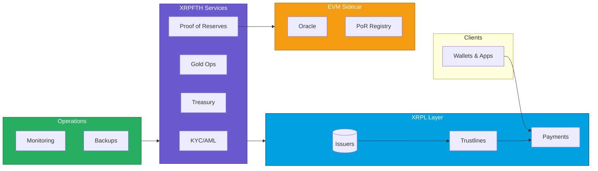

# XRPFTH — Professional Program Specs

[](#overview)
[](./docs/INDEX.md)
[](./docs/DIAGRAMS.md)

This repository is the professionally organized, boardroom‑ready documentation hub for the XRPFTH program. It includes:

- System specification and readiness gates
- Independent technical evaluation and cost/appraisal
- Color‑coded architecture diagrams and flow charts (Mermaid)
- Clear table of contents and navigable documentation structure

It intentionally contains specifications, designs, and runbooks — not production code.

---

## Why we built this (for investors)

Capital needs compliant, instant, global rails. Today’s fiat rails are slow, gated, and opaque. XRPFTH delivers a fully-documented, security-first infrastructure on XRPL with bank/KYC integration and real-time proof-of-reserves. The goal: institution‑grade issuance and settlement with auditability, programmability, and operational guardrails from day one.

- Problem: Fragmented payment rails, delayed settlement, weak transparency, and compliance friction.
- Solution: A production‑oriented reference stack on XRPL + services + banking rails with strict invariants and end‑to‑end observability.
- Why now: XRPL offers native payments and trustline semantics; our stack codifies security and compliance patterns investors demand.
- Outcome: Faster, cheaper, safer rails that can support scaled distribution to accredited investors and institutional partners.

What investors get: a de‑risked, test‑backed path to compliant issuance and redemption, with proof‑points across security, ops, and economics.

---

## Table of Contents

- [Overview](#overview)
- [How Members Use FTH](#how-members-use-fth)
- [Why XRPL & EVM](#why-xrpl--evm)
- [Trust & Transparency (PoR)](#trust--transparency-por)
- [Who FTH Is For](#who-fth-is-for)
- [Under the Hood](#under-the-hood)
- [Call to Action](#call-to-action)
- [Key Documents](#key-documents)
- [Architecture & Diagrams](#architecture--diagrams)
- [Infrastructure Overview](#infrastructure-overview)
- [Repository Structure](#repository-structure)
- [How to Use](#how-to-use)
- [Roadmap Snapshot](#roadmap-snapshot)

---

## Overview

XRPFTH covers:

- FTHUSD / USDF overlay rails
- Banking, KYC/AML, custody, compliance

This documentation defines what must exist and when it’s safe to launch.

---

## How Members Use FTH

1. Join & Verify
   - Complete KYC and activate a membership profile/NFT.

2. Load FTHUSD
   - Fund your FTHUSD balance via supported on/off‑ramp options (conceptual bank transfer or equivalent; no partners named here).

3. Earn USDF Rewards
   - Participation and program activity earn closed‑loop USDF rewards credits (framed as membership rewards, not yield).

4. Buy Discounted Gold
   - Use FTHUSD to place discounted gold and metals orders. Orders can be fulfilled (delivery) or bought back by the program (conceptually), bridging digital balance to physical asset.

5. Check Proof‑of‑Reserves
   - View coverage (e.g., ~104–105%) and click through to on‑chain PoR snapshots anchored on XRPL and recorded in an EVM PoR registry.

---

## Why XRPL & EVM

- XRPL advantages: High throughput, low fees, native issued currencies and NFTs—ideal for stable balances and membership tokens.
- EVM + Chainlink: External price feeds (e.g., metals) and a persistent PoR registry for historical, auditable records.

This combination provides battle‑tested primitives with verifiable transparency.

---

## Trust & Transparency (PoR)

We publish regular Proof‑of‑Reserves snapshots including:

- Total assets backing the program
- Total liabilities (FTHUSD/USDF)
- Coverage ratio (e.g., 104–105%)

Snapshots are recorded on an EVM PoR registry and anchored on XRPL via transaction memos so members and partners can verify reserves instead of just relying on promises.

---

## Who FTH Is For

- Members / Individuals
  - Stable digital balances with rewards and access to discounted metals
  - Quick settlement and transparent reserve reporting

- Partners (Fintechs, Banks, Metals Desks)
  - XRPL‑native rails without rebuilding the stack
  - Pre‑built program logic (PoR + membership) to reduce time‑to‑market

---

## Under the Hood

- XRPL for balances, trustlines, payments, and membership NFTs
- EVM + Chainlink for price feeds and a PoR registry
- Off‑chain services for KYC/AML, bonus engine, gold operations, and treasury
- Multi‑signature governance, RequireAuth/NoRipple issuer flags, and conservative payment rules (no partial payments, no pathfinding)
- DEX usage controls and integration/security tests baked into CI

See also:

- XRPL docs: `./xrpl/README.md`
- PoR registry spec: `./evm/specs/FTHPoRRegistry.SPEC.md`

---

## Call to Action

- Join the FTH Program (member interest)
- Talk to us about integration (partners)
- Request early access and detailed documentation

---

## Key Documents

- LAUNCH READINESS: see `LAUNCH_READINESS.md` — the gatekeeper for production readiness (green = go)
- INDEPENDENT APPRAISAL: `INDEPENDENT_TECHNICAL_EVALUATION.md` — architecture, security, economics, build/replacement costs, ratings, boardroom narrative
- INVESTOR MEMO: `docs/INVESTOR_MEMO.md` — value proposition, risk, GTM, ask
- WEBSITE PRD (Spark): `docs/WEBSITE_PRD_FOR_SPARK.md` — structured instructions for marketing page generation

See the full docs index at `docs/INDEX.md`.

For an investor‑focused deep dive (value, compliance, risk, GTM, status), see `docs/INVESTOR_MEMO.md`.

---

## Architecture & Diagrams

High‑level architecture and flows are captured in `docs/DIAGRAMS.md`. Below is the top‑level system view:



---

## Infrastructure Overview

Detailed, color‑coded infra diagrams and flows live in `docs/INFRASTRUCTURE_OVERVIEW.md`.

---

## Repository Structure

```text
fth-program-specs/
├─ README.md                        # You are here – overview + TOC
├─ LAUNCH_READINESS.md              # Launch gates, risks, timelines
├─ INDEPENDENT_TECHNICAL_EVALUATION.md # Independent appraisal & costs
├─ docs/
│  ├─ INDEX.md                      # Documentation table of contents
│  ├─ DIAGRAMS.md                   # Architecture + flow charts (Mermaid)
│  └─ INFRASTRUCTURE_OVERVIEW.md    # Environments, topology, ops
├─ contracts/                       # Contract‑level specs & mapping
├─ scripts/                         # CLI / automation design (specs)
└─ ...                              # Additional design docs
```

---

## How to Use

1. Start with `LAUNCH_READINESS.md` — treat it as a PM board; each bullet can be an issue.
2. Map design to implementation via `contracts/README.md`.
3. Keep this repo implementation‑agnostic; production code lives elsewhere.
4. Update after every material decision (banks, KYC, custody, contract deltas).

---

## Roadmap Snapshot

Near‑term focus:

1. Harden and test the current contract stack on testnets.
2. Stand up one banking relationship and one KYC/AML flow.
3. Minimal UX for FTHUSD/MyUSDF (onboard, deposit/withdraw, balances).
4. Tiny internal pilot; iterate.

This repo ensures the warp drive passes safety inspection before launch.
