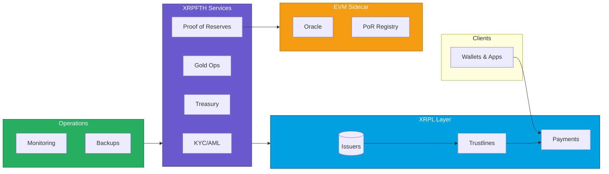

# XRPFTH — Professional Program Specs

[](#overview)
[](./docs/INDEX.md)
[](./docs/DIAGRAMS.md)

This repository is the professionally organized, boardroom‑ready documentation hub for the XRPFTH program. It includes:

- System specification and readiness gates
- Independent technical evaluation and cost/appraisal
- Color‑coded architecture diagrams and flow charts (Mermaid)
- Clear table of contents and navigable documentation structure

It intentionally contains specifications, designs, and runbooks — not production code.

---

## Table of Contents

- [Overview](#overview)
- [Key Documents](#key-documents)
- [Architecture & Diagrams](#architecture--diagrams)
- [Infrastructure Overview](#infrastructure-overview)
- [Repository Structure](#repository-structure)
- [How to Use](#how-to-use)
- [Roadmap Snapshot](#roadmap-snapshot)

---

## Overview

XRPFTH covers:

- FTH Dubai Shariah Gold (FTHS)
- TGUSD Stablecoin
- FTHUSD / USDF overlay rails
- Banking, KYC/AML, custody, compliance

This documentation defines what must exist and when it’s safe to launch.

---

## Key Documents

- LAUNCH READINESS: see `LAUNCH_READINESS.md` — the gatekeeper for production readiness (green = go)
- INDEPENDENT APPRAISAL: `INDEPENDENT_TECHNICAL_EVALUATION.md` — architecture, security, economics, build/replacement costs, ratings, boardroom narrative

See the full docs index at `docs/INDEX.md`.

---

## Architecture & Diagrams

High‑level architecture and flows are captured in `docs/DIAGRAMS.md`. Below is the top‑level system view:



---

## Infrastructure Overview

Detailed, color‑coded infra diagrams and flows live in `docs/INFRASTRUCTURE_OVERVIEW.md`.

---

## Repository Structure

```text
fth-program-specs/
├─ README.md                        # You are here – overview + TOC
├─ LAUNCH_READINESS.md              # Launch gates, risks, timelines
├─ INDEPENDENT_TECHNICAL_EVALUATION.md # Independent appraisal & costs
├─ docs/
│  ├─ INDEX.md                      # Documentation table of contents
│  ├─ DIAGRAMS.md                   # Architecture + flow charts (Mermaid)
│  └─ INFRASTRUCTURE_OVERVIEW.md    # Environments, topology, ops
├─ contracts/                       # Contract‑level specs & mapping
├─ scripts/                         # CLI / automation design (specs)
└─ ...                              # Additional design docs
```

---

## How to Use

1. Start with `LAUNCH_READINESS.md` — treat it as a PM board; each bullet can be an issue.
2. Map design to implementation via `contracts/README.md`.
3. Keep this repo implementation‑agnostic; production code lives elsewhere.
4. Update after every material decision (banks, KYC, custody, contract deltas).

---

## Roadmap Snapshot

Near‑term focus:

1. Harden and test the current contract stack on testnets.
2. Stand up one banking relationship and one KYC/AML flow.
3. Minimal UX for FTHUSD/MyUSDF (onboard, deposit/withdraw, balances).
4. Tiny internal pilot; iterate.

This repo ensures the warp drive passes safety inspection before launch.
