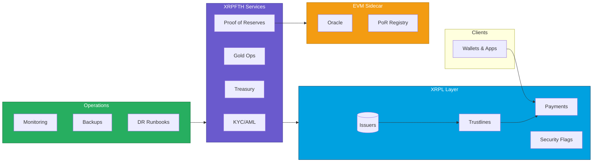
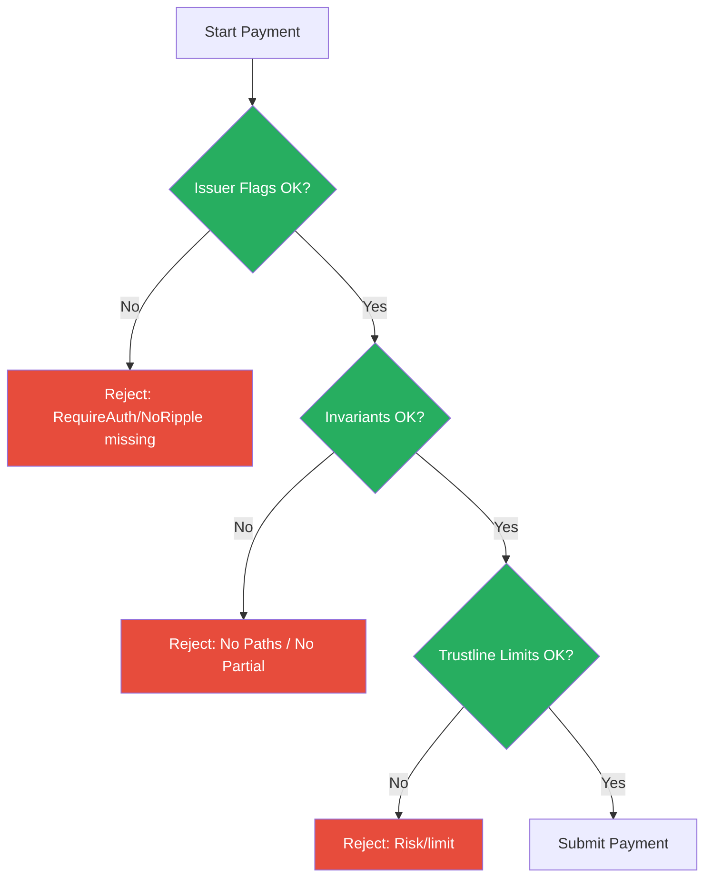
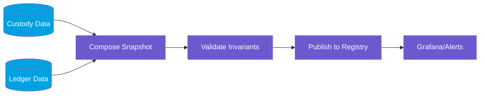
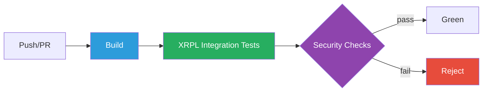

# XRPFTH Architecture & Flow Diagrams

## 1) System Architecture (color‑coded)

## 2) XRPL Payment Security Flow

## 3) Proof‑of‑Reserves Snapshot Pipeline

## 4) CI Pipeline (XRPL Integration Tests)

