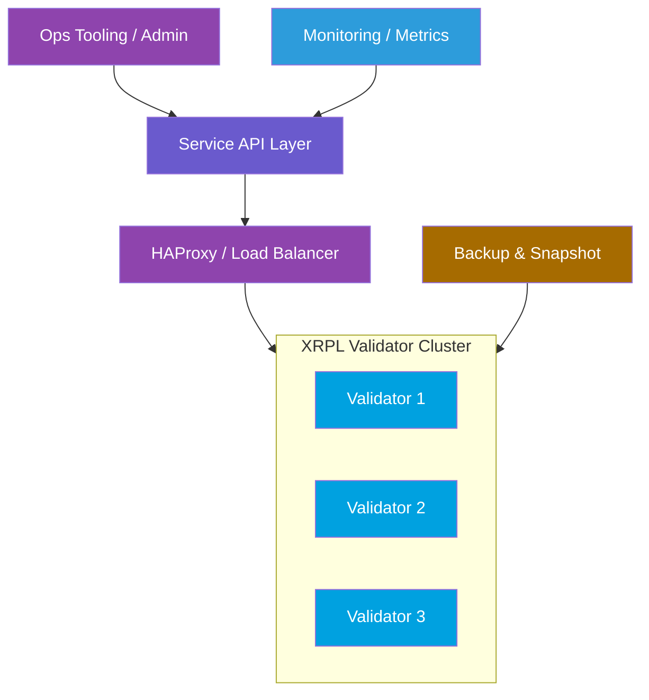
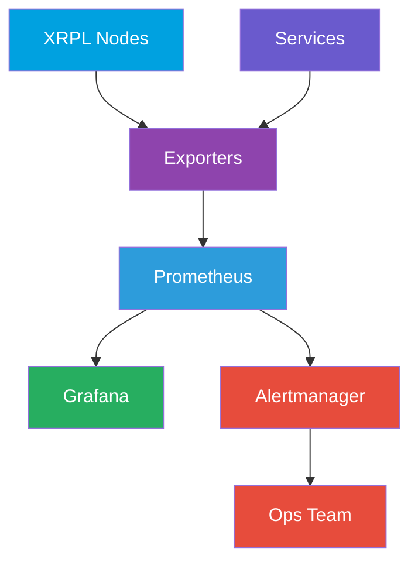
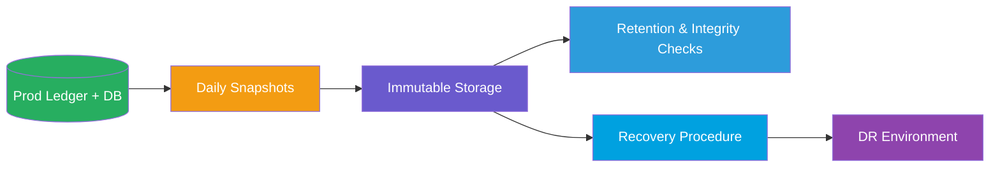

# XRPFTH Infrastructure Overview

This document provides a color‑coded overview of environments, topology, operational controls, and monitoring flows supporting XRPFTH.

## 1) Environment Layers

## 2) Production Topology (Simplified)

## 3) Operational Controls Flow

## 4) Monitoring Data Flow

## 5) Backup & DR Overview

## Notes

- Color coding is consistent across diagrams for quick visual parsing.
- Detailed runbooks and thresholds should be appended as readiness matures.
- All production changes must flow through the Operational Controls pipeline.
